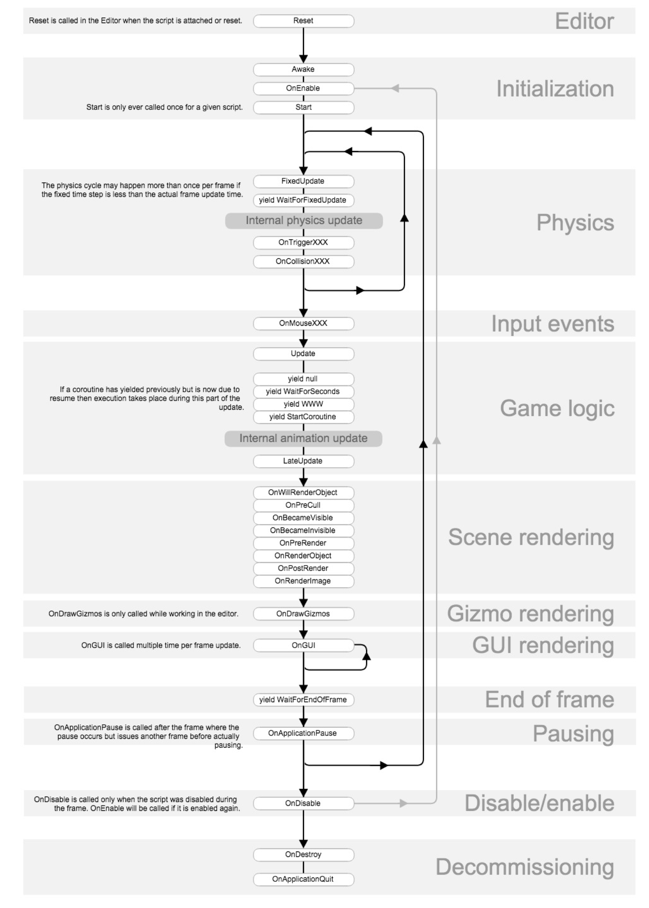
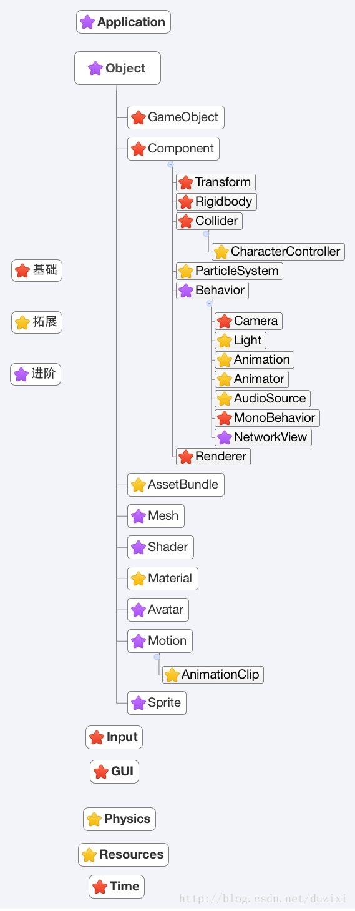
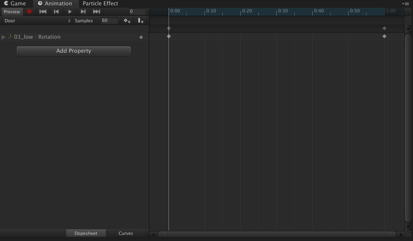

# UnityLearn-UnityScript


## 语法结构

- 命名空间与类名必须一致
- 写好的脚本必须附加到物体上才能执行
- 附加到游戏物体的脚本类必须从 MonoBehaviour 类继承


## 编译过程

**源代码** --（CLS）-- > **中间语言** --（Mono Runtime）--> **机器码**


## 脚本编译工具

Unity 编辑器中，Edit ->Preferences，在弹出的对话框中单击左侧 Extenal Tool 命令，然后在 External Script Editor 下拉列表中选择 VS Code 作为 Unity 默认的编辑器


## 类？对象？

- Scripts（一个类） 挂到 GameObject 上时会创建一个对象。
- GameObject 上的一个 Component 是一个对像：如 Transform、Camera、Audio Listener 都是对应类（Transform 类、Camera 类、Audio Listener 类）的对象
- GameObject 是 GameObject 类的一个对象
- 每个 GameObject 中都有一个数组管理 Components 对象的**引用**


## 代码

- 默认不写就是 private
- Update 如果不删除，即使里面不写内容，也会每帧被调用（内存中会给它开辟一个栈帧）
- 在 Unity/Editor/Data/Resources/    /81-C# Script-NewBehaviourScripts.cs.txt 中可以修改创建 Scripts 后默认生成的代码

-  若 Script 中设置  ```public int a = 100``` ，在 Inspector 中将 a 的值修改为 200，那么运行时 a 的值为 200，因为  Script 中是类的初始化，Inspector 中则是为类的对象重新赋值。

```c#
// Lifecycle.cs
using System.Collections;
using System.Collections.Generic;
using UnityEngine;

public class Lifecycle : MonoBehaviour{

// C# 类
// - 字段
// - 属性（get、set）
// - 构造函数
// - 方法

// 脚本
// - 字段
// - 方法

    // 序列化字段 作用：在编辑器中显示私有变量
    [SerializeField]
    private int a = 100;

    // 作用：在编译器中隐藏字段
    [HideInInspector]
    public float b;

    // 作用：在编译器中在一个范围内调整数值
    [Range(0, 100)]
    public int c;
    
    // 属性：在编译器中不能显示，通常脚本中不写
    // public int A{
    //     get
    //     {return this.a;}
    //     set
    //     {this.a = value;}
    // }

    // 通常不要再脚本中写构造函数
    // public Lifecycle(){

    //     // 不能在子线程中访问主线程成员
    //     // 创建脚本对象是在子线程里做的
    //     // Unity 提供的功能是主线程里做的
    //     // 不能跨线程访问
    //     // 不要在构造函数中使用 Unity 提供的功能
    //     b = Time.time; // 这行代码会报错

    //     // 游戏创建时会调用两次构造函数，执行时机不是我们想要的
    //     Debug.log("构造函数"); // 编译器中创建一次这个对象，运行时创建两次这个对象
    // }
    
}
```


## 脚本生命周期（必然事件、消息Message）

文档：MonoBehaviour 下的消息

```c#
// Lifecycle.cs
using System.Collections;
using System.Collections.Generic;
using UnityEngine;

public class Lifecycle : MonoBehaviour{
    // ---------------------------------------脚本生命周期------------------------------------
    // -----------------------------------------初始阶段-------------------------------------
    // 初始阶段
    // 执行时机：创建游戏对象 --> 立即执行1次（脚本不启用也执行）
    // 早于 OnEnable 和 Start
    // 作用：初始化
    private void Awake(){

        Debug.Log("Awake--" + Time.time + "--" + this.name);
    }

    // 初始阶段
    // 执行时机：每当脚本对象启用时调用
    // 同一个物体晚于 Awake，早于 Start，执行完第一个物体的 Awake 后执行该物体的 OnEnable，再执行下一个物体的 Awake 和 Enable
    // 作用：常用于在游戏开始前进行初始化，可以判断当满足某种条件执行此脚本 this.enable = true
    private void OnEnable(){

        Debug.Log("OnEnable--" + Time.time + "--" + this.name);
    }

    // 初始阶段
    // 执行时机：创建游戏对象 --> 脚本启用 --> 才执行1次
    // 晚于 Awake 和 Enable，且所有物体的 Awake 和 Enable 执行完后，再执行所有 Start
    // 作用：常用于数据或游戏逻辑初始化
    private void Start(){

        Debug.Log("Start--" + Time.time + "--" + this.name);
    }

    // -----------------------------------------物理阶段-------------------------------------
    // 执行时机：脚本启用后，每隔固定时间被调用
    // 更新频率：默认为 0.02s，设置更新频率：Edit -> Project Setting -> Time -> Fixed Timestep
    // 作用：适用于对游戏对象做物理操作，例如移动、旋转、施加力等
    // 不会受到渲染影响，渲染时间不固定（每帧渲染量不同、机器性能不同）
    private void FixedUpdate(){

         Debug.Log("FixedUpdate--" + Time.time + "--" + this.name);
    }

    // -----------------------------------------游戏逻辑-------------------------------------
    // 执行时机：渲染帧执行，执行间隔不固定（每帧渲染量不同、机器性能不同）
    // 作用：处理游戏逻辑
    private void Update(){

        Debug.Log("Update--" + Time.time + "--" + this.name);
    }

    // // 执行时机：在 Update 函数被调用后执行，和 Update 在同一帧执行
    // // 作用：适用于跟随逻辑
    private void LateUpdate(){

        Debug.Log("LateUpdate--" + Time.time + "--" + this.name);
    }

    // -----------------------------------------输入事件：物体必须有 Collider------------------
    // 执行时机：鼠标移入到当前 Collider 时调用
    private void OnMouseEnter(){

        Debug.Log("OnMouseEnter--" + Time.time + "--" + this.name);
    }

    // 执行时机：鼠标经过当前 Collider 时调用
    private void OnMouseOver(){

        Debug.Log("OnMouseOver--" + Time.time + "--" + this.name);
    }

    // 执行时机：鼠标离开当前 Collider 时调用
    private void OnMouseExit(){

        Debug.Log("OnMouseExit--" + Time.time + "--" + this.name);
    }

    // 执行时机：鼠标按下当前 Collider 时调用
    private void OnMouseDown(){

        Debug.Log("OnMouseDowns--" + Time.time + "--" + this.name);
    }

    // 执行时机：鼠标在当前 Collider 上抬起时调用
    private void OnMouseUp(){

        Debug.Log("OnMouseDowns--" + Time.time + "--" + this.name);
    }
    
    // -----------------------------------------场景渲染：物体必须有 Mesh Renderer-------------
    // 执行时机：当 Mesh Renderer 在任何相机上可见时调用（变成看见那帧执行 1 次）
    private void OnBecameVisible(){

        Debug.Log("OnBecameVisible--" + Time.time + "--" + this.name);
    }

    // 执行时机：当 Mesh Renderer 在任何相机上都不可见时调用（变成看不见那帧执行 1 次）
    private void OnBecameInvisible(){

        Debug.Log("OnBecameInvisible--" + Time.time + "--" + this.name);
    }

    // -----------------------------------------结束阶段-------------------------------------
    // 执行时机：对象变为不可用或附属游戏对象非激活状态时被调用
    private void OnDisable(){

        Debug.Log("OnDisable--" + Time.time + "--" + this.name);
    }

    // 执行时机：当脚本销毁或附属的游戏对象被销毁时被调用
    private void OnDestroy(){

        Debug.Log("OnDestroy--" + Time.time + "--" + this.name);
    }

    // 执行时机：应用程序推出时被调用
    private void OnApplicationQuit(){

        Debug.Log("OnApplicationQuit--" + Time.time + "--" + this.name);
    }
}
```




## Debug

- 控制台调试

  消耗性能，忘记删掉游戏会很卡。

  - Debug.Log
  - print 也是调用的 Debug.Log

- 定义公有变量，程序运行后在检测面板查看数据（可以看变化的数值）

- 编译器调试
  1. 加断点
  2. 编译器点击运行（启动调试）
  3. Unity Editor 点击 Play，运行场景

- 单帧调试（适合 Update）
  1. 编译器点击运行（启动调试）
  2. Unity Editor 点击 Play，运行场景
  3. 暂停游戏
  4. 加断点
  5. 单帧执行
  6. 结束调试

（可以使用 Windows - Analysis - Frame Debugger 查看每一帧的渲染情况）

 

## 常用 API




### Component

Component 类提供了查找（在当前 GameObject、后代、先辈）组件的功能。

Variables 变量：

- gameObject：组件附加的 GameObject
- transform：组件附加的 GameObject 的 transform
- tag

Functions 函数：

- 判断标签与传入字符串是否相等：```other.CompareTag("Player")```

- GetComponent / GetComponents
- GetComponentsInChildren
- GetComponentsInParent

```c#
// ComponentDemo.cs
using System.Collections;
using System.Collections.Generic;
using UnityEngine;

// Component 类提供了查找（在当前 GameObject、后代、先辈）组件的功能
public class ComponentDemo : MonoBehaviour{

    private void OnGUI(){

        if (GUILayout.Button("transform")){

            // 挂载在 GameObject 上的 Script 可以直接访 问GameObject 的 Transform，
            // 原因是 Script 中的类继承自 MonoBehaviour，MonoBehaviour 继承自 Behaviour，Behaviour 继承自 Component，
            // Component 中有对当前 GameObject 的 Transform 的引用这个属性，可以直接使用。
            this.transform.position = new Vector3(1, 1, 1);
        }

        if (GUILayout.Button("GetComponent")){

            // GetComponent 方法在 Component 类中
            // GetComponent<MeshRenderer>() 返回 GameObject MeshRenderer 组件的引用
            this.GetComponent<MeshRenderer>().material.color =  Color.red;
        }

        if (GUILayout.Button("GetComponents")){

            // 获取当前 GameObject 所有组件
            var allComponent = this.GetComponents<Component>();
            foreach (var item in allComponent){
                print(item.GetType());
            }
        }

        if (GUILayout.Button("GetComponentsInChildren")){

            // 获取当前 GameObject 和 后代 GameObject 的所有指定类型组件（从自身开始）
            // 如果使用 GetComponentInChildren，则只寻找到一个指定类型组件就停止
            var allComponent = this.GetComponentsInChildren<MeshRenderer>();
            foreach (var item in allComponent){
                item.material.color = Color.red;
            }
        }

        if (GUILayout.Button("GetComponentsInParent")){

            // 获取当前 GameObject 和 先辈 GameObject 的所有指定类型组件（从自身开始）
            // 如果使用 GetComponentInParent，则只寻找到一个指定类型组件就停止
            var allComponent = this.GetComponentsInParent<MeshRenderer>();
            foreach (var item in allComponent){
                item.material.color = Color.red;
            }
        }
    }
}
```


### Transform

继承自 Component。

Tranform 类提供了查找（父、根、子（索引、名称））、变换组件、改变位置、角度、大小功能。

Variables 变量：

- foreach -- transform

- SetParent

- Find

- GetChild：根据索引查找

  *练习：使用 Find 和 GetChild 可以实现在层级未知情况下查找子物体：递归*

- DetachChild：所有子对象解除父子关系

- SetParent(None)：于父物体解除父子关系

- GetSiblingIndex：获取该对象的同级索引

- SetSiblingIndex：设置该对象的同级索引

- SetAsFirstSibling：设置该对象的同级索引为0

- SetAsLastSibling：设置该对象的同级索引为最末

考虑到**性能**，

this.transform 尽量不要在 Update 中使用，更好的方法是在 Start 中获取引用后存入到一个 private 变量中，再在 Update 中调用，避免每次  this.transform 都进行查找。（在 c# 中，基本数据类型是值传递，class 是引用传递。

同理， this.GetComponent<组件名>() 也应尽量在 Update 里面少用，更好的方法是在 Start 中获取引用后存入到一个 private 变量中，再在 Update 中调用。

```c#
// TransformDemo.cs
using System.Collections;
using System.Collections.Generic;
using UnityEngine;

// Tranform 类提供了查找（夫、根、子（索引、名称））变换组件、改变位置、角度、大小功能
public class TransformDemo : MonoBehaviour{
    public Transform tf;

    // ---------------------------------------查找变换组件------------------------------------
    private void OnGUI(){

        if(GUILayout.Button("foreach -- transform")){
            // child 为每个子物体的变换组件（不包括自身，且只是子节点，不包含孙子等后代节点）
            foreach(Transform child in transform){
                print(child.name);
            }
        }

        if(GUILayout.Button("root")){

            // 获取根物体变换组件（没有根的返回自己）
            Transform rootTF = this.transform.root;
        }

        if(GUILayout.Button("parent")){

            // 获取父物体变换组件
            Transform parentTF = this.transform.parent;
        }

        if(GUILayout.Button("SetParent")){

            // 设置为父物体，当前物体的位置视为世界坐标，所以在 Scene 中位置不移动
            // this.transform.SetParent(tf);
            // 设置为父物体，当前物体的位置视为 LocalPosition，在 Scene 中位置会移动
            this.transform.SetParent(tf, false);
        }

        if(GUILayout.Button("Find")){

            // 根据名称获取子物体（只能找儿子，不能找孙子）
            Transform childTF = this.transform.Find("子物体名称");
            // 确保父子关系一直不回改变时才写路径，否则不要写
            // 找孙子，写路径
            // Transform childTF = this.transform.Find("子物体名称/子物体名称");
            // 找重孙子，写路径
            // Transform childTF = this.transform.Find("子物体名称/子物体名称/子物体名称");
        }

        if(GUILayout.Button("GetChild")){

            int count = this.transform.childCount;
            // 根据索引获取子物体，孙子不行
            for (int i = 0; i < 0; i++){
                Transform childTF = this.transform.GetChild(i);
            }
        }

        // 使用 Find 和 GetChild 可以实现在层级未知情况下查找子物体：递归

        // ---------------------------------------改变位置、角度、大小-------------------------
        if(GUILayout.Button("pos / scale")){

            // 物体相对于世界坐标系远点的位置
            // this.transform.position
            // 物体相对于父物体轴心点的位置
            // this.transform.localPosition

            // 物体相对于父物体的缩放比例
            // this.transform.localScale
            // 理解为：物体相对于模型缩放比例（自身缩放比例 * 副物体缩放比例）
            // 如：父物体 localScale 为 3，当前物体 localScale 为 2，则 lossyScale 为 6
            // 只读
            // this.transform.lossyScale
        }
        
        if(GUILayout.Button("Translate")){

            // 向自身坐标系 z 轴 移动 1米
            // this.transform.Translate(0, 0, 1);
            // 向世界坐标系 z 轴 移动 1米
            this.transform.Translate(0, 0, 1, Space.World);
        }

        if(GUILayout.Button("Rotate")){

            // 沿自身坐标系 y 轴 旋转 10 度
            // this.transform.Rotate(0, 0, 1);
            // 沿世界坐标系 y 轴 旋转 10 度
            this.transform.Rotate(0, 10, 0, Space.World);
        }

        // RepeatButton：长按持续旋转
        if(GUILayout.RepeatButton("RotateAround")){

            // 绕原点、 y 轴 旋转 1度
            // this.transform.RotateAround(Vector3.zero, Vector3.up, 1);
            // 绕原点、 z 轴 旋转 1度
            this.transform.RotateAround(Vector3.zero, Vector3.up, 1);
        }
    }
}
```


### GameObject

Hierachy 面板里所有东西都是 GameObject。

用于禁用、启用、创建、查找 GameObject，以及创建 Component。

Variables 变量：

- activeInHierachy：场景中的游戏对象是否激活？即实际的激活状态：试想这种场景：爸爸的勾取消了，自己的勾还在，但是在场景中被禁用了

- activeSelf：局部激活状态（只读），即自身激活状态。就是物体在 Inspector 里面的勾是不是还在
- transform
- name

Functions 函数：

- SetActive：设置物体启用/禁用
- AddComponent：不可以直接 new 一个 Component
- GameObject.Find("游戏对象名称")    慎用

Static Functions 静态函数：

- Find：慎用！
- FindGameObjectsWithTag
- FindGameObjectWithTag
- FindWithTag

可以根据其中一个 Component 找其他 Component（详见 Component 模块），

也可以根据 GameObejct 找 Component

- GetComponent / GetComponents
- GetComponentsInChildren
- GetComponentsInParent

### Object

Variables 变量：

- name：对象的名字

Static Functions 静态函数：

- Destroy：删除一个游戏对象、组件或资源（参数是 Object，可以删除任何东西），可以设置时间（几秒后删除），比如敌人死后几秒销毁
- DontDestroyOnLoad：加载新场景的时候使目标对象不被销毁，一般重新 Load 场景会把所有对象销毁再重新创建一遍。
- FindObjectOfType：根据类型（脚本类）找对象引用，例如 Enemy 类的脚本在不同 GameObject 实例化的 Enemy 对象的引用
- FindObjectsOfType：根据类型（脚本类）找对象引用
- Instantiate：克隆原始物体并返回克隆物体（传入 GameObject、Transform等）

```c#
// GameObjectDemo.cs
using System.Collections;
using System.Collections.Generic;
using UnityEngine;

public class GameObjectDemo : MonoBehaviour
{
    private void OnGUI(){

        // 场景中的游戏对象是否激活？即实际的激活状态。试想这种场景：爸爸的勾取消了，自己的勾还在，但是在场景中被禁用了
        // this.gameObject.activeInHierarchy
        // 局部激活状态（只读），即自身激活状态。就是物体 Inspector 里面的勾是不是还在
        // this.gameObject.activeSelf

        // 设置物体启用还是禁用
        // this.gameObject.SetActive();

        if (GUILayout.Button("添加光源")){

            // 不可以直接 new 一个 Component：light = new Light();
            // 1. 创建物体
            GameObject lightGO = new GameObject();
            // 2. 在物体上添加组件
            Light light = lightGO.AddComponent<Light>();
            // 3. 修改组件的属性
            light.color = Color.red;
            light.type = LightType.Point;
        }

        // 在场景中根据名称查找物体（慎用），而this.transform.Find("游戏对象名称") 只查找子物体，可以使用
        // GameObject.Find("游戏对象名称")

        // 获取所有使用该标签的物体
        GameObject[] allEnemy = GameObject.FindGameObjectsWithTag("Enemy");
        // 获取使用该标签的物体（单个）
        GameObject playerGO1 = GameObject.FindGameObjectWithTag("Player");
        GameObject playerGO2 = GameObject.FindWithTag("Player");
        
        // ----------------------------------------Object-----------------------------------
        // 根据类型查找对象（component）
        MeshRenderer mr = Object.FindObjectOfType<MeshRenderer>();
        MeshRenderer[] mrs = Object.FindObjectsOfType<MeshRenderer>();
        // Object.Destroy()
    }
    // 练习：查找血量最低的敌人
    // 提示：查找 Enemy 脚本
}
```


### 练习1：查找血量最低和距离最近的敌人

```c#
// Enemy.cs
using System.Collections;
using System.Collections.Generic;
using UnityEngine;

public class Enemy : MonoBehaviour
{
   public float HP;
}
```

```c#
// FindEnemy.cs
using System.Collections;
using System.Collections.Generic;
using UnityEngine;

public class FindEnemy : MonoBehaviour
{

    private void OnGUI(){

        if(GUILayout.Button("查找血量最低的敌人")){
            // 查找场景中所有 Enemy 类型的引用
            Enemy[] allEnemy = Object.FindObjectsOfType<Enemy>();
            // 获取血量最低的对象引用
            Enemy min = FindEnemyByMinHP(allEnemy);
            // 根据 Enemy 类型引用获取其他组件类型引用
            min.GetComponent<MeshRenderer>().material.color = Color.red;
        }

        if(GUILayout.Button("查找距离最近的敌人")){
            // 查找场景中所有 Enemy 类型的引用
            Enemy[] allEnemy = Object.FindObjectsOfType<Enemy>();
            // 获取距离最近的对象引用
            Enemy min = FindEnemyByMinDistance(allEnemy);
            // 根据 Enemy 类型引用获取其他组件类型引用ß
            min.GetComponent<MeshRenderer>().material.color = Color.green;
        }
    }

    // 查找血量最低的敌人
    public Enemy FindEnemyByMinHP(Enemy[] allEnemy){
        // 假设第一个就是血量最低的敌人
        Enemy min = allEnemy[0];
        // 一次次与后面比较
        for (int i = 1; i < allEnemy.Length; ++i){
            if(min.HP > allEnemy[i].HP){
                min = allEnemy[i];
            }
        }
        return min;
    }

    // 查找距离最近的敌人
    public Enemy FindEnemyByMinDistance(Enemy[] allEnemy){
        // 假设第一个就是距离最近的敌人
        Enemy min = allEnemy[0];
        // minDistance 存储当前最近的距离
        float minDistance = Vector3.Distance(this.transform.position, min.transform.position);
        
        for (int i = 1; i < allEnemy.Length; ++i){

            float newDistance = Vector3.Distance(this.transform.position, allEnemy[i].transform.position);
            if(newDistance < minDistance){
                min = allEnemy[i];
                minDistance = newDistance;
            }
        }
        return min;
    }
}
```


### 练习2：在层级未知情况下查找子物体

```c#
// TransformHelper.cs
using System.Collections;
using System.Collections.Generic;
using UnityEngine;

public class TransformHelper : MonoBehaviour
{
    // 在层级未知情况下查找子物体
    // 传入：父物体变换组件，子物体名称
    // 返回：
    public static Transform GetChild(Transform parentTF, string childName){
        // 在子物体中查找
        Transform childTF = parentTF.Find(childName);
        if(childTF != null) return childTF;

        // 将问题交由子物体
        int count = parentTF.childCount;
        // 遍历所有子物体，在子物体的子物体中查找
        for (int i = 0; i < count; i++){
            childTF = GetChild(parentTF.GetChild(i), childName);
            if(childTF != null) return childTF;
        }
        // 找不到
        return null;
    }
}
```

```c#
// TransformHelperTest.cs
using System.Collections;
using System.Collections.Generic;
using UnityEngine;

public class TransformHelperTest : MonoBehaviour
{
    private void OnGUI(){
        if(GUILayout.Button("层级未知，查找子物体")){
            Transform childTF = TransformHelper.GetChild(this.transform, "TFHelper (5)");
            if(childTF != null){
                childTF.GetComponent<MeshRenderer>().material.color = Color.red;
            }
            else print("没有这个子物体。");
        }
    }
}
```


## Time

全都是 Static Properties 静态属性

- frameCount：游戏到现在过了多少帧了
- timeSinceLevelLoad：以秒计算，从最后关卡已加载完的时间（只读）。

```c#
// TimeDemo.cs
using System.Collections;
using System.Collections.Generic;
using UnityEngine;

public class TimeDemo : MonoBehaviour
{
    // public float t;

    public float speed = 100;

    public float seeDeltaTime;
    public float seeUnscaledDeltaTime;
    public float seeTime;
    public float seeUnscaledTime;
    public float seeRealtimeSinceStartup;

    // 渲染场景时执行，不受 TimeScale 影响
    // 但是如果使用 Time.deltaTime，Time.deltaTime 受 TimeScale 影响
    public void Update(){

        // t = Time.time;

        // 每渲染帧 执行 1 次，旋转 1 度
        // 1s 渲染？度数
        // 帧多 1s 旋转速度快
        // 帧少 1s 旋转速度慢
        // this.transform.Rotate(0, 1, 0);
        // 当旋转/移动速度（Time.deltaTime） * 每帧消耗时间，可以保证旋转/移动速度不受机器性能以及渲染影响
        // this.transform.Rotate(0, speed * Time.deltaTime, 0);

        // Time.deltaTime 受 TimeScale 影响
        // 以秒计算，完成最后一帧的时间（只读）
        seeDeltaTime = Time.deltaTime;
        // Time.unscaledDeltaTime 不受 TimeScale 影响
        seeUnscaledDeltaTime = Time.unscaledDeltaTime;
        
        // Time.time 受 TimeScale 影响
        // 以秒计算，游戏到现在的时间
        // 除去了编译器卡顿的时间
        seeTime = Time.time;
        // Time.unscaledTime 受 TimeScale 影响
        // 包含了编译器卡顿的时间
        seeUnscaledTime = Time.unscaledTime;
        // 实际游戏运行时间
        // 包含了编译器卡顿的时间
        seeRealtimeSinceStartup = Time.realtimeSinceStartup;


        // 游戏暂停，虽然在不受影响的 Update 里，但使用的 Time.deltaTime 受影响
        // this.transform.Rotate(0, speed * Time.deltaTime, 0);
        // 游戏暂停，个别物体不受影响，则可以在 Update 里使用 Time.unscaledDeltaTime 实现
        this.transform.Rotate(0, speed * Time.unscaledDeltaTime, 0);

    }

    // 固定 0.02s 执行一次，与渲染无关，受 TimeScale 影响
    // public void FixedUpdate(){

    //     this.transform.Rotate(0, speed, 0);
    // }

    private void OnGUI(){

        if(GUILayout.Button("暂停游戏")){

            // 时间的缩放，可以用于减慢运动效果
            // 默认为 1.0，和实时时间一样快，0 为暂停游戏（FixedUpdate 不再执行，Update 不受影响）
            // FixedUpdate 受影响，Update 不受影响
            Time.timeScale = 0;
        }

        if(GUILayout.Button("继续游戏")){
            Time.timeScale = 1;
        }
    }
}
```


### 隔一段时间执行代码 / 重复执行的代码

### 练习：倒计时

使用 Text 制作倒计时预制件

从 02:00 开始，最后 10s 字体为红色，时间为 00:00 后停止计时。

- Invoke
- IsInvoking
- InvokeRepeating
- CancelInvoke / CancelInvoke("Timer3")

```c#
using System.Collections;
using System.Collections.Generic;
using UnityEngine;
using UnityEngine.UI;

// 倒计时
// 从 02:00 开始，最后 10s 字体为红色，时间为 00:00 后停止计时。
public class CountdownTimer : MonoBehaviour
{
    // 需求：1s 修改 1次 Text 文本内容
    // 1. 查找组件引用
    // 2. 定义变量：秒 second
    // 3. 120 --> 02:00  119 --> 01:59
    // 4. 修改文本
    // 5. 如何每秒修改一次 重点：在 Update 每帧执行的方法中，个别语句实现指定间隔执行一次

    private Text txtTimer;
    public int second = 120;

    private void Start(){

        txtTimer = this.GetComponent<Text>();

        // 重复调用
        // 参数 1：Timer3，需要重复调用的方法
        // 参数 2：1，开始调用的时间，即从第 1s 开始调用
        // 参数 3：1，调用的频率，即 1s 调用 1 次
        InvokeRepeating("Timer3", 1, 1);

        // 延迟调用
        // Invoke(“被执行方法”, 开始调用时间);

        // 是否有任何方法被 Invoke 调用？
        // IsInvoking()
    
        // 该方法是否正在被调用？
        // IsInvoking("被执行方法")
    }

    private void Update(){

       // Timer1();
       // Timer2();
    }

    // 方法 1：Time.time
    // 下次修改时间
    private float nextTime = 1;
    private void Timer1(){

        // 如果到了修改时间
        if(Time.time > nextTime){

            second--;
            // d2：2 位数，以 0 来填充
            txtTimer.text = string.Format("{0:d2}:{1:d2}", second / 60, second % 60);

            // 设置下次修改时间
            nextTime = Time.time + 1;
        }
    }

    // 方法 2：Time.deltaTime
    // 累计时间
    private float totalTime;
    private void Timer2(){

        // 累加每帧间隔
        totalTime += Time.deltaTime;

        // 如果到了修改时间
        if(totalTime >= 1){

            second--;
            // d2：2 位数，以 0 来填充
            txtTimer.text = string.Format("{0:d2}:{1:d2}", second / 60, second % 60);

            totalTime -= 1;
        }
    }

    // 方法 3：InvokeRepeating，每隔固定时间，重复执行
    // 查看 Start：InvokeRepeating("Timer3", 1, 1);
    private void Timer3(){

        second--;
        // d2：2 位数，以 0 来填充
        txtTimer.text = string.Format("{0:d2}:{1:d2}", second / 60, second % 60);

        if(second == 0)
            // CancelInvoke()：取消这个 MonoBehaviour 里的所有 Invoke 调用
            // CancelInvoke("Timer3")：取消 Timer3 的 Invoke 的调用
            CancelInvoke("Timer3");
    }

    // 对比方法 3 和方法 1、2
    // 方法 3 适用于每隔固定时间，重复执行
    // 方法 1、2 可以根据需求动态修改间隔的时间

    // 对比方法 1 和方法 2，主要区别：先做还是先等
    // 试想场景：按下鼠标左键，每隔 1s 发射 1发子弹
    // 方法 1 比较适合：方法 1 将 nextTime 设为 0，鼠标按下就可以开始发射子弹
    // 方法 2 则要先等待累计到 1s，再发射子弹
    // 试想场景：一个人先走，走到某个点停留一段时间再走
    // 方法 2 比较适合
}
```

#### 预制件

一种资源类型，可以多次在场景进行实例。

本质是一个配置文件。

可以使用预制件通过代码创建 GameObject。

优点：对预制件的更改，可以同步到所有实例，从而提高开发效率。

通过预制件创建的 GameObject：

- 当修改其属性后点击 Prefab - Apply，则将修改的属性同步到预制件，使得其他由该预制件创建的 GameObject 也得到相应属性的修改。
- 当修改其属性后不点击 Prefab - Apply，则该属性和属性值在 Inspector 里面显示为粗体，当预制件该属性有所更改时，此 GameObject 的该属性不受影响（即允许实例有自己的属性值，如果单独修改实例的属性值，则该值不再随预制件变化）。
- Prefab - Select 键：通过预制件实例选择对应预制件
- Prefab - Revert 键：放弃实例属性值，还原预制件属性值
- Prefab - Apply 键：将某一实例的修改应用到所有实例


## Animation

### 开门动画

#### 创建 Animation Clip

通过动画视图可以直接创建和修改动画片段（Animation Clips）

1. 显示动画（Animation）视图：Window - Animation

2. 为物体添加 Animation 组件

3. 在动画（Animation）视图中点击 Create 创建片段命名为 Door.anim，保存在 Animations 文件夹中

   **Animation Clip - Inspector - Wrap Mode：**

   - Default
   - Once：播放一次
   - Loop：循环播放
   - Ping Pong：头 -> 尾 -> 头 -> 尾 -> ...
   - Clamp Forever：只播放一次，播放完成后固定在最后，再也不能再播了。

4. Animation 视图中 左侧 AddProperty - Transform - Rotation

**时间线**：



- 可以单击时间线上的任何位置预览或修改动画片段
- 数字显示为秒数和帧数。例如：1:30 表示 1 秒和 30 帧

5. 拖动结束关键帧到 0:30，表示开门动画为 0.5s
6. 选中结束关键帧，修改 Rotation
7. 点击播放按钮，可以看到自动创建了补间动画
8. 可以在开始和结束之间添加关键帧
9. 将 Project 中的动画片段 Door 拖到物体 Inspector - Animation - Animation
10. 给门添加 Collider Component（用于触发 OnMouseDown 事件）
11. 将 Animation - Play Automatically 设为 false，表示只由 Script 控制

### Animation 类

Variables 变量：

- isPlaying
  - bool isPlay = animation.isPlaying;
  - bool isPlay = animation.isPlaying("动画名");

Functions 函数：

- Play
  - animation.Play("动画名");
- CrossFade
  - animation.PlayQueue("动画名");
  - 淡入淡出，人物跑步动画和静止动画的平滑过渡 
- PlayQueued
  - animation.PlayQueue("动画名");
  - 在前一个动画播放完成之后直接播放下一个动画。如果使用 Play 和  CrossFade 未播完 A 之后会马上播放 B
- animation["动画名"].speed = 1;
  - 播放速度
  - 1：正常
  - 2：2倍速
  - 0：不播放
  - -1：倒着播放
- animation["动画名"].wrapmode = WrapMode.PingPong;
- animation["动画名"].length;
  - 动画总长度
- animation["动画名"].time;
  - 当前播放时间

```c#
using System.Collections;
using System.Collections.Generic;
using UnityEngine;

public class Door : MonoBehaviour{

    // 门的状态：true 表示开门
    public bool doorState = false;
    // 动画片段名称
    public string animName = "Door";

    private Animation anim;

    private void Start(){

        anim = GetComponent<Animation>();
    }

    private void OnMouseDown(){
        
        // 如果开门状态
        if(doorState){
            
            // 如果此时动画没有正在播放
            // 即不是开门开到一半（门完全打开了）
            // 修改 time 为动画的长度，否则默认 time 为 0 
            // 从动画最后开始倒着播
            if(anim.isPlaying == false){
                // 从最后开始播
                anim[animName].time = anim[animName].length;
            }
            // 如果此时动画正在播放
            // 即开门开到一半
            // 不需要修改 time， 即从当前 time 开始倒着播

            // 关门操作，倒着播
            anim[animName].speed = -1;
        }
        // 如果关门状态
        else{
            // 开门操作
            // 正着播动画
            anim[animName].speed = 1;
        }
        // 播放动画
        anim.Play(animName);
        // 修改门的状态
        doorState = !doorState;
    }
}
```

